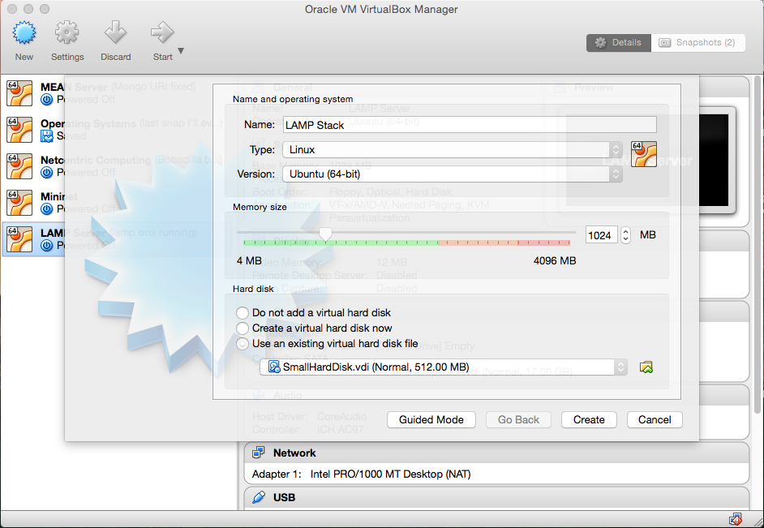
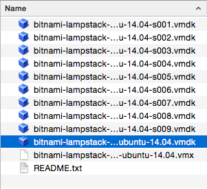
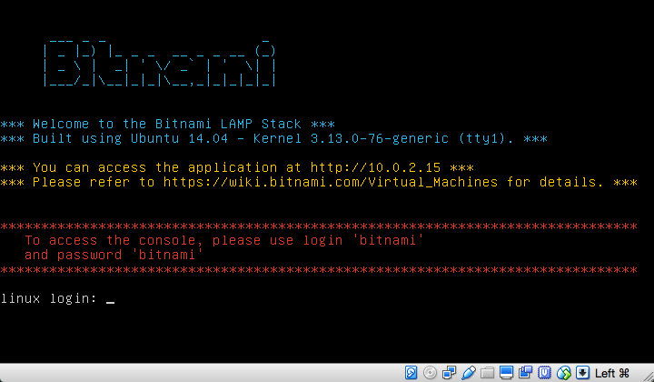
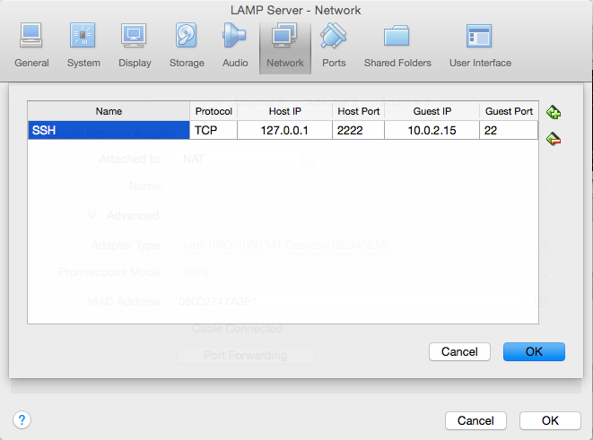
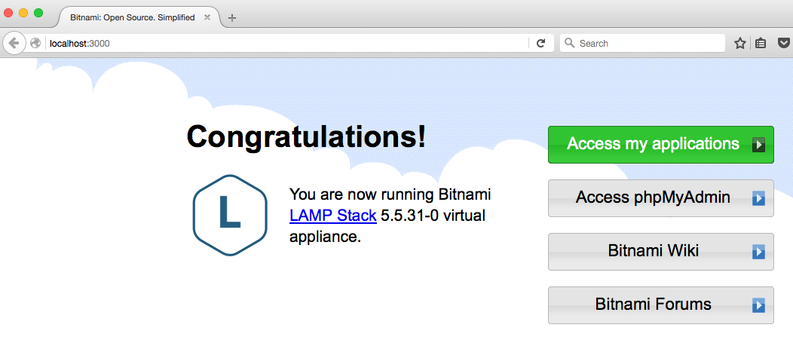

# Bitnami offline environment #

## The problem ##
Multiple people changing different parts of server configuration and developing
code for an application that is running that same server. If everyone develops
at the same time on the same server, complications and consistency
issues are bound to arise. It could also be hard to track who is doing what and which parts of the
code interacts with each other

## The solution ##
When a programming team settles on creating an application on a remote server,
it is important that each member of the team have an offline environment. This
offline environment is what allows everyone to develop without messing up the
server that is running (or is going to run) the application.

## Setting up an offline environment ##
What you will need:
- [Virtual Box](https://www.virtualbox.org/wiki/Downloads)
- [Bitnami](https://bitnami.com/)
- Terminal (_OS X_)
- [PuTTY](http://www.chiark.greenend.org.uk/~sgtatham/putty/download.html) or
[CMDER](http://cmder.net/) (_Windows_)

#### Description ####
Is this amazing software which allows you to emulate another operating
system on top of your operating system; so you could have a Linux machine inside
your Windows or OS X. Your Windows (or OS X) is what we call the _Host_ machine,
while your emulated Linux is what we will refer to as _Guest_ machine. Since the
operating system is virtualized, we call it a Linux Virtual Machine (there is no
real machine, your host operating system merely emulates it).

This is great for testing drivers, kernel modules, hacks, and guess what? Web
Applications! Since most of the Internet runs Linux we are going to try the same
exact combination, Virtual Box + Linux Virtual Machine.

Most servers running web applications on the Internet rely on what we call a
[software stack](https://en.wikipedia.org/wiki/Solution_stack). LAMP being one
of the most popular ones. We already know what the L in LAMP stands for, but
let's take a look at the other letters.

|L| Linux|
|:-:|
|A| Apache |
|M| MySQL  |
|P| PHP    |

LAMP Stack is merely a combination of free, open source technologies that allows
a server to run an Web Application.

Instead of downloading a Linux Virtual Box image and then downloading,
installing and setting up each of these letters of the stack, we can take a
major shortcut by visiting the amazing [Bitnami stacks](https://bitnami.com/stacks)
page.

Here you can browse through a major catalog of different server stacks, and once
you are happy with your choice you can simply download a Virtual Box image that
comes with all the software described in the stack already installed, setup,
and configured. Trust me they are making our lives A LOT easier!

### Step 1 ###
Download and install [Virtual Box](https://www.virtualbox.org/wiki/Downloads).
 
Windows users should also install either [PuTTY](http://www.chiark.greenend.org.uk/~sgtatham/putty/download.html) or [CMDER](http://cmder.net/) (I highly
recommend CMDER).

_p.s. Not sure if the mini version of CMDER has SSH so get the full version._

### Step 2 ###
Download the Bitnami Stack image.
For the sake of this example, we will download a LAMP Stack image which you can
find [here](https://bitnami.com/stack/lamp/virtual-machine).
Once completed, extract the contents of the .zip file somewhere sensible.
I recommend creating a folder called "Virtual Machines" either
in Desktop or Documents, and then create another folder inside it for each
virtual machine you download. Make a sensible choice, moving this folder later
might be troublesome so you want to get this right from the start.

### Step 3 ###
Importing the image into Virtual Box is simple. Once Virtual Box is open, click
"New".  On the following pop up window, name your server whatever you like,
make it type: Linux, version: Ubuntu, and if possible, give it at least 1024 MB
for smoothness.

Mark the "Use an existing virtual hard disk file" option, click
on the folder with green up-chevron icon on the right side and select the vmdk
file that has no part number on its name.

#### possible detour ####
OS X users might get an error message at this point. Some Bitnami vmdk images do not
like OS X very much and might not run. It took me a while to figure this one out;
the simplest hack is to convert the .vmdk files into a single .vdi file (.vdis
tend to behave nicely in OS X's Virtual Box).

Link for solution is [here](https://nfolamp.wordpress.com/2010/06/10/converting-vmdk-files-to-vdi-using-vboxmanage/).

### Step 4 ###
Once your image is successfully created, it is time to launch it!
Click start on the big green arrow button on Virtual Box's ribbon. You should
see a little console window fire up. Once it is done booting, you should see
something like this:

According to Bitnami's documentation: 
`linux login: bitnami` 
`password: bitnami` 
You can change this to your liking later.

### Step 5 ###
Secure Shell is another great program. Released in 1995, it is an updated
version of the 1969's Telnet. Secure Shell allows you to remotely access other
machines over the internet, including that virtual machine running on your
Virtual Box!

For this, we must first enable SSH in our Virtual Machine.
According to Bitnami's documentation, this can be quickly done by typing:

`\$ sudo mv /etc/init/ssh.conf.back /etc/init/ssh.conf` 
`\$ sudo start ssh`

Now we go back to Virtual Box's screen. With our Virtual Machine selected, we
click "Settings". 
On the following pop up window we click "Network" and on the
bottom we click "Port Forwarding". 
Click on the little green **+** button on the right side to add a new rule.

Feel free to copy the same rules as the ones on the screen shot.
What we are doing here is quite simple. Whenever we connect to ourselves (Host)
using the default loopback IP address (127.0.0.1) on port 2222, we will tunnel
that connection to the local IP of our Guest machine (10.0.2.15) and port 22.
Port 22 is SSH's default port. Click okay and your new rule should be enabled.

We are now ready to SSH our way in!

### Step 6 ###
OS X users should fire their terminal application and simply type:
`\$ ssh bitnami@localhost -p 2222` 
type in the password (bitnami) and you will be inside your guest machine from
your host machine's terminal.

_localhost is an alias for 127.0.0.1_

Windows users do not have that luxury without third party software.
Fire up CMDER, type the same command and it will too!

### Step 7 ###
Now that you learned the basics of SSHing, just type `exit` to quit.
At this point, we already have our own offline web server! However, what good
can that server be if we cannot preview how its web content looks on a browser?

We will SSH our way in again, but this time we will pass extra flags.
The Bitnami image comes with an Apache HTTP server by default. This server
responds to HTTP requests and serves a default Web Page (HTML) in response. In
case you don't know, HTTP connections happen on `port 80`. Remember how we just
tunneled our Host machine's IP 127.0.0.1 port 2222 into Guest machine's
10.0.2.15 port 22? We will do the same, but this time we will use an SSH command.

`\$ ssh bitnami@localhost -p 2222 -L 3000:localhost:80`

`-L` flag stands for local. 
`3000` host machine's port 
`localhost` IP address 
`80` guest machine's port.

So whenever we connect to http://localhost:3000 on our Host machine, we will be
connecting to our Guest machine's localhost:80. This is what is called tunneling
(in case you haven't realized).

Type in your password again. Open your browser, connect to
http://localhost:300 and you should see this:

---
We will stop for now. 

Next steps:
- Basic Linux commands (setting up root password)
- Linux file structure
- Setting up a text editor (Vim, Atom, Sublime Text). 
- Setting up Github
- Creating a basic web application with LAMP Stack (HTML, CSS, JS, PHP)
